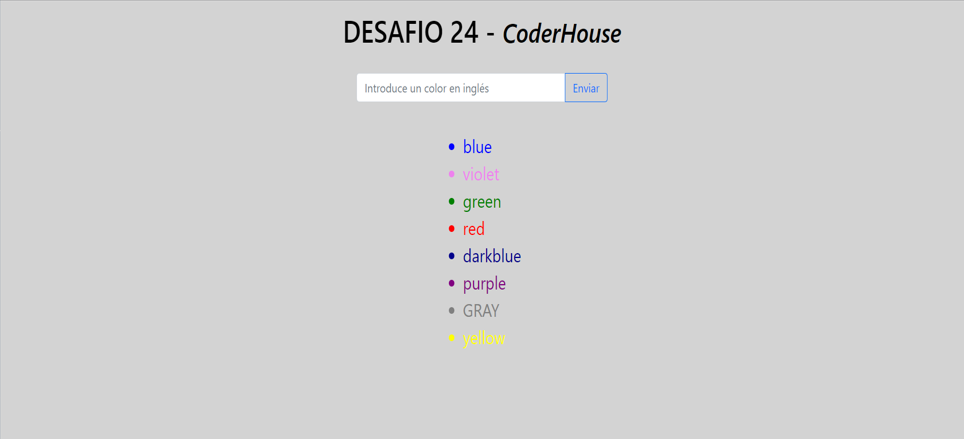

# Desafío 23 - Programación Backend

### CoderHouse

# SERVIDOR EN DENO

Consigna: 
1. Crear un servidor que utilice el módulo http servest y genere la vista con React render.

2. Configurar denon para que, ante un cambio de código, el servidor de reinicie automáticamente.
    
    El servidor presentará en su ruta raíz un formulario de ingreso de un color, que será enviado al mismo por método post. Dicho color (en inglés) será incorporado a un array de colores persistido en memoria.
    
    Por debajo del formulario se deberán representar los colores recibidos en una lista desordenada (ul) utilizando el mismo color para la letra en cada caso. El color de fondo del la vista será negro.

NOTA: El servidor deberá tener extensión tsx para el correcto funcionamiento de la sintaxis de vista de React en Typescript.

## Ejecución

Se configuro DENON el similar a NODEMON en Node, para facilitar la ejecución de la app, mediante archivon DENON.json

### instalar deno

iwr https://deno.land/x/install/install.ps1 -useb | iex

### instalar denon

deno install -qAf --unstable https://deno.land/x/denon/denon.ts.

### Para ejecutar usar 

denon start

es lo mismo que ejecutar 

"deno run --allow-net --allow-read --allow-env ./src/server.tsx"

## API

http://localhost:8080/

## Soporte APP

   

